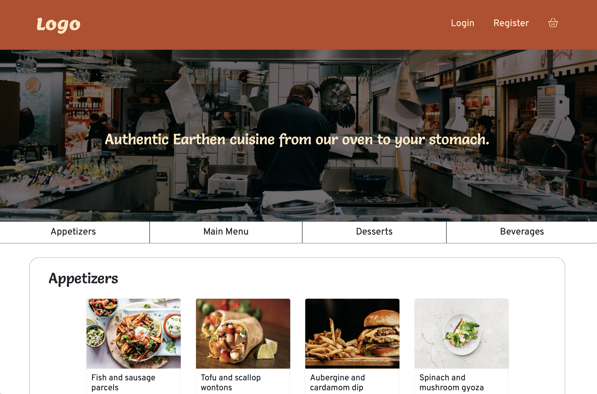
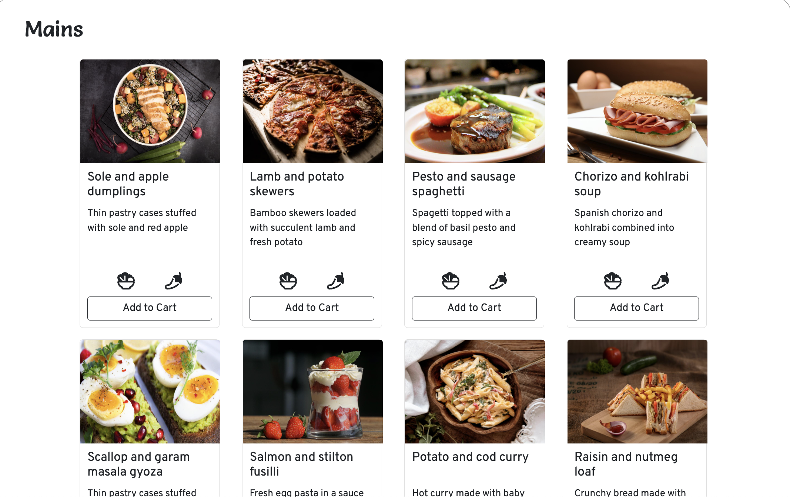
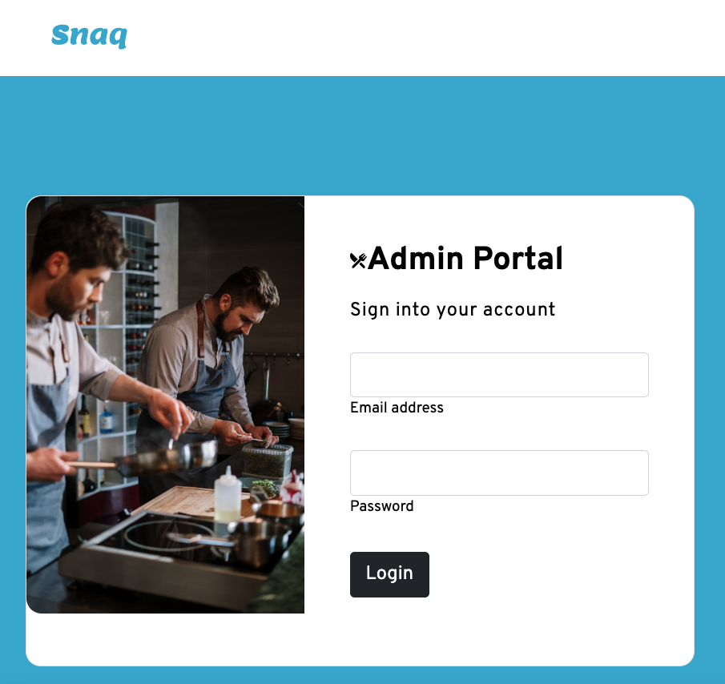
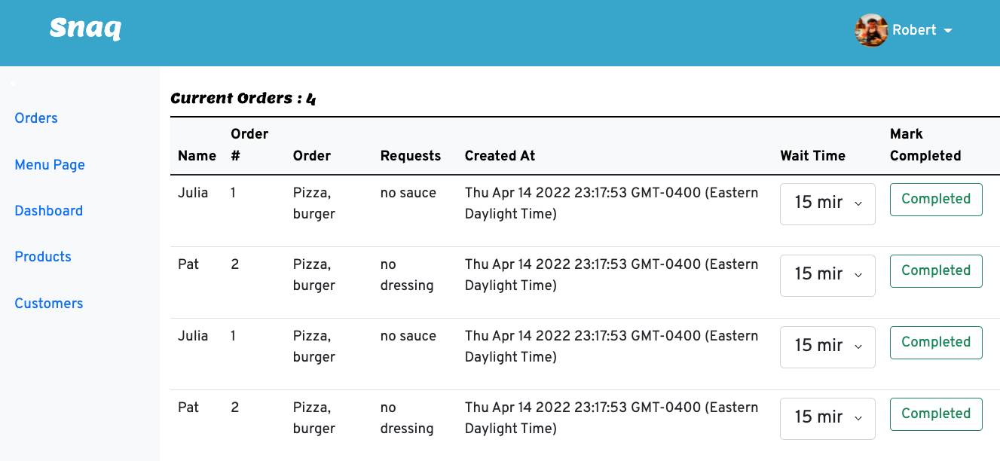

# Snaq A Food Pick-Up Ordering Website

Snaq is a food ordering app that let's customers skip the line. Customers are able to select one or more dishes and place an order for pickup. Using a Twilio API, customers recieve a notification when their order is ready . The restaurant gets an alert that someone ordered. Snaq serves as an intermediary.
Snaq also has an admin portal that allows for restaurant owners to provide wait times and mark orders as complete.

This website was built by Patrice Pavico, Gonzo Nieto, and Julia Tran using HTML, CSS, JS, jQuery, Ajax, EJS, and PostgreSQL.

## Setup

Interested in trying Snaq?

- Have [`npm`](https://www.npmjs.com/) installed
- clone this repo to your machine
- install dependencies with `npm install` command
- run the server with `npm start`
- once the server is running, you can visit Snaq at `http://localhost:8080/`

## Dependencies

- Node 10.x or above
- NPM 5.x or above
- PG 6.
- Twilio
- Ejs
- Sass

## Screenshots

